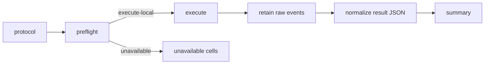
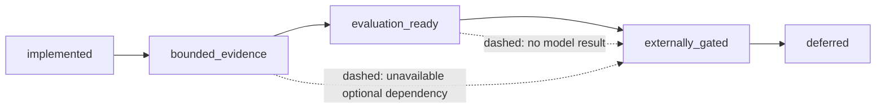

# Evaluation

Conflux reports security and utility separately. A blocked adversarial proposal
is defence evidence; it is not an executed violation. Proposed, authorised,
blocked, modeled, executed, provider-failed, incomplete, and excluded outcomes
remain distinguishable throughout normalization.

## Current evidence boundary

| Track | Repository status | What is evidenced |
|---|---|---|
| Native SLED reproduction | `bounded_evidence` | One deterministic finite run over three paired fixtures and five negative controls |
| Verification COI reduction | `bounded_evidence` | Two finite IR fixtures have matching reference verdicts, measurable reduction, and one lifted unsafe witness; optional formal binaries were unavailable |
| AgentDojo comparison | `evaluation_ready` | Pinned translation, six-cell conservative/oracle runner, argument mediation, and fake-backed conformance tests; no model result |
| Four-mode planning | `evaluation_ready` | Eight scenarios, 32-cell runner, inert modeled-program validation, and offline tests; no model result |
| Dual-backend laptop planning smoke | `evaluation_ready` | Fixed two-scenario, four-mode, two-runtime 16-cell protocol and fake-backed runner; no model-generated bundle |
| Scoped delegation model | `implemented` | Exact one-use grants, lifecycle evidence, atomic consumption, and seven killed mutants; operational ITES consumption remains denied |
| Cedar differential | `evaluation_ready` | Strict corpus, PARC translation, oracle decisions, and binary preflight; Cedar remains unavailable and parity is not evidenced |
| Direction security mutants | `bounded_evidence` | Canonical argument/disclosure/attribution and delegation models exhaust safely; all seeded defects have shortest native witnesses |

The retained native bundle is
[`runs/native-sled-reproduction-v1/`](../runs/native-sled-reproduction-v1/).
It detects all five defective monitors with one-step witnesses and records 60
transitions across the paired evaluation. The archived approximately 1.5
million-trace statement is retained as historical input but marked
non-comparable because the current checker explores canonical states rather
than enumerating prototype traces.

These numbers support only the recorded fixtures, properties, implementation
commit, and bounds. They are not deployment-security estimates.

The retained COI bundle is
[`runs/sled-coi-reduction-v1/`](../runs/sled-coi-reduction-v1/). It compares
original and reduced models under the independent reference interpreter. An
unavailable optional solver is recorded as unavailable and contributes no
equivalence evidence.

## Version-two experiment protocol

`experiment-protocol-v2.schema.json` fixes the track, suite and schema
versions, input hashes, code commit, prompts, seeds, repetitions, bounds,
environment class, rerun command, and exact model identity when a model is
used. The resolved manifest adds completeness, exclusions, categorized
failures, environment metadata, and output checksums. Existing schema-v1 smoke
results remain readable; unknown versions and fields fail closed.

A curated bundle contains:

- raw canonical events;
- normalized result JSON;
- the requested protocol and resolved manifest;
- a summary generated only from normalized results;
- checksums and one rerun command.

Wall-clock presentation data is excluded from semantic fingerprints. Missing
cases and failures remain visible rather than being dropped from aggregates.

## Self-hosted model experiments

Model-dependent tracks share `LocalModelPort` and `LocalModelSpec`. The two
supported experiment adapters are an OpenAI-compatible self-hosted endpoint
and an in-process Transformers model loaded from the local cache. Model and
tokenizer revisions, weight-manifest digest, template version, sampling,
context limit, placement, dtype, and runtime are part of the protocol.

There is no hosted-service fallback. HTTP defaults to loopback; a private GPU
endpoint requires an explicit flag. Transformers uses
`local_files_only=True` and `trust_remote_code=False`. The operator owns model
acquisition, licensing, storage, and server access. Core CI uses fakes and
never downloads weights or contacts a server.

Without `--execute-local`, AgentDojo and planning commands validate the
protocol and print or write the complete matrix, bounds, and adapter preflight.
The retained readiness package is
[`runs/direction-readiness-v1/`](../runs/direction-readiness-v1/). Its
`unavailable` cells are readiness evidence, not empirical results.

## Track semantics

Native SLED evaluates legacy and corrected fixtures separately from identical
parent states. A canonical safety oracle judges every monitor, so a defective
monitor cannot define its own success. Effects are applied only to an abstract
evaluation state; the production executor is never invoked.

The delegation model checks scope, beneficiary, ordering, expiry, revocation,
one-use consumption, non-redelegation, and unchanged Principal Context. Its
SLED results are model evidence only: no grant is accepted by the operational
ITES pipeline while the independent Cedar-parity gate is absent.

The Cedar preflight validates the pinned bundle and differential corpus,
translates pointwise PARC requests, computes the deterministic in-memory
oracle result, and checks a supplied binary's bytes against the configured
identity. It never invokes Cedar. The retained
[`cedar-differential-preflight-v1`](../runs/cedar-differential-preflight-v1/)
bundle therefore establishes evaluation readiness only.

AgentDojo fixes benign/attacked inputs across no defence, conservative ITES,
and oracle ITES under one model specification. Conservative annotations retain
external influence; oracle annotations are a non-deployable ground-truth upper
bound. Roles and reviewed selectors are hashed before results. Raw upstream
logs remain unchanged, while Principal Context, provenance, argument-policy
decisions, and certificate bindings are stored in a separate augmentation
stream. Setup, model, parser, policy, security, tool, utility, and bound
failures are counted independently.

Planning compares `reactive`, `static`, `dynamic`, and `dynamic_code` across
eight diagnostics. `dynamic_code` emits a validated `ModeledProgram`: an inert
graph of existing typed actions and declared read/write effects. It is never
evaluated, imported, compiled, passed to a shell, or sent to an executor. ITES
mediates each declared effect at action time, after which only an in-memory
modeled world changes. Results therefore say `modeled`, not `executed`.

The laptop smoke selects only `direct-authorised-effect` and
`blocked-action-recovery`. It uses one seed and repetition over all four modes
through direct Transformers and loopback llama.cpp, producing 16 separately
identified cells. It is an integration check, not an efficacy comparison, and
the workflow stops for human review after its first live bundle.

## Rationale

| Decision | Why |
|---|---|
| Separate implementation readiness from bounded evidence | A tested runner does not establish model behavior or benchmark efficacy |
| Retain failed and incomplete cases | Removing them biases security and utility aggregates |
| Use one exact model identity in every cell | Comparisons should vary the defence or planning mode, not silently vary the model |
| Judge monitors with an independent oracle | A vulnerable defence must not label its own unsafe effect as correct |
| Model dynamic programs as data | It tests planning expressiveness without adding arbitrary-code execution to the evaluation TCB |
| Keep historical numbers non-comparable when semantics differ | Reproducibility requires explaining disagreement, not normalizing it away |

See the [claim ledger](CLAIMS.md), [CLI guide](CLI.md), and
[model setup](integrations/models.md) before interpreting or running a track.
