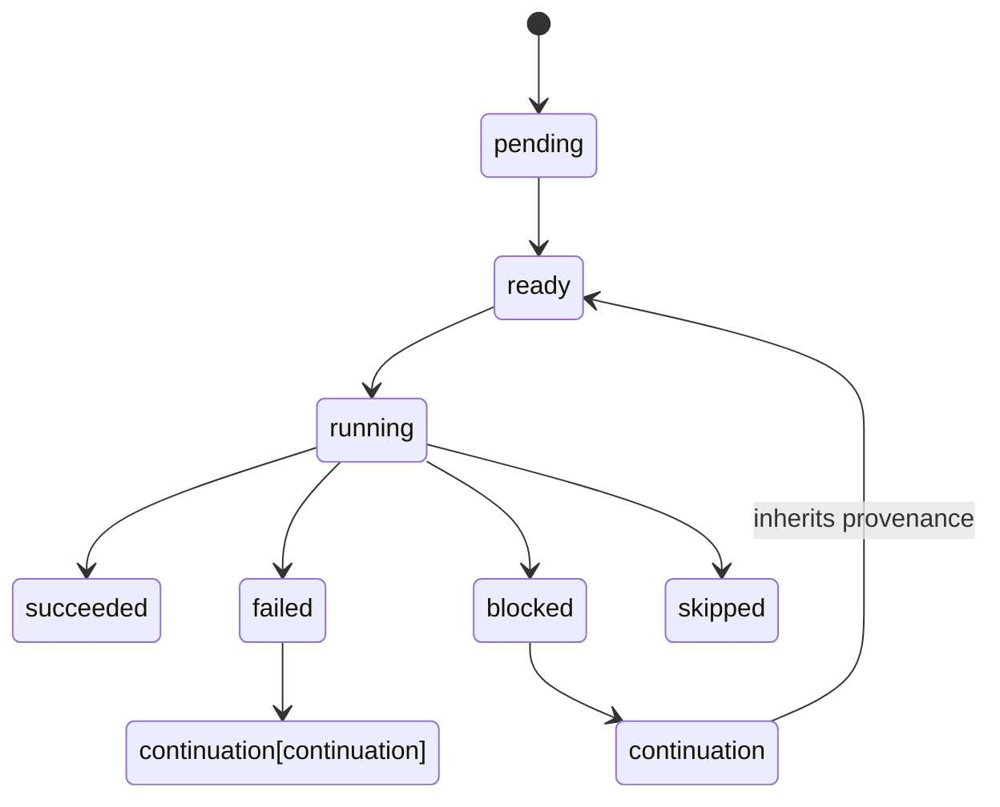
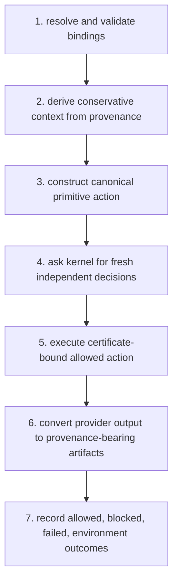

# Specification 015: Open-ended dynamic planning

Type: specification
Status: accepted for staged implementation

## Evidence source and reconciliation

This specification translates the immutable
`research/reports/archive/2026-07-30-dynamic-planning-programme/Conflux_Codex_Progress_and_Dynamic_Planning_Plan_2026-07-30.json`
task graph into canonical repository decisions. The report inspected public
`main`, not this dependent milestone branch. Its legacy-package and known
security-defect observations are superseded here by the validated M0--M4
commits. Its dynamic-planning findings remain applicable.

The raw report files and archived paper are never edited. Manuscript changes
are made only in `research/publications/manuscript/`.

## Objective

Support a deterministic and replayable agent plan that can produce values,
ground later effects, branch, loop, request a new typed plan fragment, create
a subplan, and request sandboxed code execution. Every observable or effectful
ground action must pass through the canonical ITES decision pipeline at action
time.

This feature does not claim complete verification of arbitrary generated code,
unbounded continuations, or real-model behaviour.

## Trusted boundaries

- The operation catalogue is authenticated application configuration.
- Artifact values and provenance are trusted only when created or attested by
  a configured adapter.
- Planner output is untrusted structured data.
- The plan executor controls graph mutation, bounds, and deterministic order.
- ITES independently decides read, authorisation, visibility, and consent.
- An executor receives only an allowed action and its exact certificate.
- A code sandbox, when configured, enforces the approved capability envelope.

## Canonical types

### Operations and bindings

`OperationSchema` has a stable identifier, version, required permission,
provider, typed argument definitions, and a canonical fingerprint. An
`OperationCatalogue` rejects duplicate identities and resolves only exact
authenticated identifiers.

An `ActionTemplate` references an operation by identifier and version. Each
named argument has exactly one typed binding:

- `LiteralBinding` stores a JSON value and trusted construction provenance;
- `ArtifactBinding` references an input artifact;
- `NodeOutputBinding` references one output of a completed node.

`ground()` validates required and additional arguments, resolves references,
and produces an immutable serialisable `GroundAction`. The ground action's
Principal Context is derived from invocation, control, branch, and argument
provenance. An empty or unknown union remains unknown and fails closed in
ITES. A ground action converts to a canonical `PrimitiveAction`; arbitrary
operation names from a planner are never accepted.

### Plans

Every `Plan` has a schema version, stable ID, goal, entry nodes, typed nodes,
invocation provenance, and a canonical fingerprint. Node IDs are unique and
dependencies must resolve. Cycles are represented explicitly by `LoopNode`;
implicit dependency cycles are invalid.

The initial node set is:

- `ModelCallNode`: produces provenance-bearing values without effects;
- `ActionTemplateNode`: grounds and mediates one effect;
- `BranchNode`: selects a declared edge from a provenance-bearing condition;
- `LoopNode`: repeats a declared body within a local iteration bound;
- `ContinuePlanningNode`: asks for a typed patch;
- `ApprovalNode`: records an approval request but manufactures no authority;
- `DelegationNode`: remains unsupported and becomes blocked;
- `SubplanNode`: starts a validated child plan;
- `TerminalNode`: succeeds, safely stops, or fails.

All nodes carry control provenance and declared input dependencies.

### Continuations

`ContinuationRequest` contains the goal, immutable plan, completed summary,
selected observations, authenticated catalogue fingerprint, remaining
budgets, trigger outcome, and trusted request provenance.

`PlanPatch` supports append, replacement of an unstarted subtree, child-plan
spawn, and termination. Patch operations are applied in canonical order.
Completed, running, failed, blocked, and skipped history is immutable. New
nodes inherit the union of their declared control provenance and the trusted
request provenance. Malformed or inapplicable patches produce an explicit
`plan.patch_rejected` record and fail closed.

`PlannerPort.initial_plan()` and `PlannerPort.continue_plan()` perform no
effects. A `PlannerRecord` retains planner identity/configuration, request and
response hashes, parsed object hash, token/latency metadata when available,
and a redacted raw response.

## Execution state machine

Node states are `pending`, `ready`, `running`, `succeeded`, `failed`,
`blocked`, and `skipped`. Ready nodes are ordered by `(plan_id, node_id,
node_fingerprint)`. Each transition returns a new immutable state.

The configured bounds include plan nodes, transitions, planner calls,
continuation depth, loop iterations, effects, output bytes, and elapsed time.
Exhaustion is an explicit incomplete outcome, never success.

For an action node:

1. resolve and validate bindings;
2. derive the conservative context from trusted provenance;
3. construct the canonical primitive action;
4. ask the canonical kernel for fresh independent decisions;
5. execute only the exact certificate-bound allowed action;
6. convert the provider output to provenance-bearing artifacts; and
7. record allowed, blocked, failed, and environment outcomes.

A block or provider failure may activate a declared continuation. That
continuation inherits the failed node's control and observed-result
provenance. It cannot restore removed authority.

## Code execution

`CodeExecutionRequest` binds a source artifact, runtime identity, input
artifacts, output contract, and `CapabilityEnvelope`. The envelope covers the
workspace, read/write mounts, network destinations, credential capabilities,
wall time, memory, processes, and output bytes.

Core code only defines and mediates this request. A sandbox adapter must:

- avoid host-shell interpolation;
- reject path traversal and symlink escapes;
- deny network and credentials by default;
- reject unsupported limits rather than approximate them;
- retain source/runtime/envelope hashes, observed I/O, exit status, resource
  use, and output provenance.

The deterministic test adapter does not execute host code. A production claim
requires retained evidence from a separately reviewed confinement backend.

## Trace, replay, and schemas

Versioned schemas cover plans and patches. Trace events add:

- `plan.created`, `plan.completed`, and `plan.failed`;
- `plan.node_ready`, `plan.node_started`, and terminal node states;
- `plan.binding_resolved` and `plan.action_grounded`;
- `plan.continuation_requested`;
- `plan.patch_received`, `plan.patch_applied`, and `plan.patch_rejected`;
- `plan.subplan_created`; and
- `code.requested`, `code.completed`, and `code.failed`.

Every record includes run, plan, node, branch, and causal parent IDs where
applicable. Fingerprints exclude non-semantic wall-clock values. Replay from
the initial plan plus patch records must reconstruct the final graph and node
states.

## SLED and formal semantics

Native SLED treats each continuation as nondeterministically returning any
well-formed patch within configured node, depth, value, call, and transition
bounds. Code may produce any effect allowed by its capability envelope.
Shortest plan-level counterexamples are retained.

The serialisable verification IR contains no hidden callbacks. A backend must
record the model, query, solver, assumptions, and result hashes. Unsupported
operations, unbounded domains, and absent tools return `UNKNOWN`.

## Failure categories

Invalid schema, unknown operation, unresolved binding, unknown provenance,
invalid graph, immutable-history mutation, malformed planner output, planner
failure, policy denial, policy failure, consent absence, visibility denial,
certificate mismatch, provider failure, sandbox unavailable, unsupported
capability, and every exhausted bound are distinct fail-closed outcomes.

## Acceptance criteria

- Strict immutable types and JSON Schemas round-trip deterministically.
- Authenticated operation identity cannot come from free text.
- Literal, artifact, and node-output grounding preserve provenance.
- Cycles are explicit; accidental dependency cycles are rejected.
- Continuations cannot mutate completed history or reset Principal Context.
- Every provider effect is re-authorised and certificate-bound.
- Delegation remains explicitly unsupported and denied.
- Scripted fixtures cover allowed, blocked, failed, malformed, replanned,
  subplan, loop, revocation, and bound-exhausted paths.
- A deterministic installed-CLI demo contains an allowed effect, a blocked
  effect, and a continuation-generated recovery subplan.
- Plan traces validate, replay, and regenerate byte-for-byte.
- Native SLED produces a shortest planning counterexample and reports all
  active bounds.
- Formal and external adapters fail closed or return `UNKNOWN` when gated.
- Documentation and the task registry distinguish implementation, bounded
  evidence, external evidence, and deferred research.

## Delivery mapping

| Slice | Tasks | Exit evidence |
|---|---|---|
| Contracts | PLAN-DYN-000..004 | ADR, immutable types, schemas, planner ports |
| Runtime | PLAN-DYN-005..008, 010..011 | scripted demo and mediated trace |
| Code | PLAN-DYN-009, 013 | fail-closed sandbox contract and adversarial corpus |
| Real model | PLAN-DYN-012, 016 | offline replay plus gated live experiment |
| Verification | PLAN-DYN-014..015 | bounded model and serialisable IR |
| Optimisation | PLAN-DYN-017 | deterministic hard-security selection |
