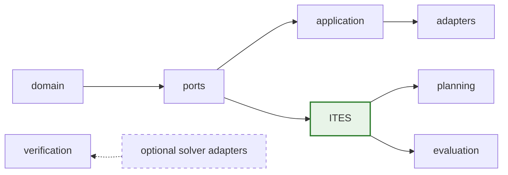
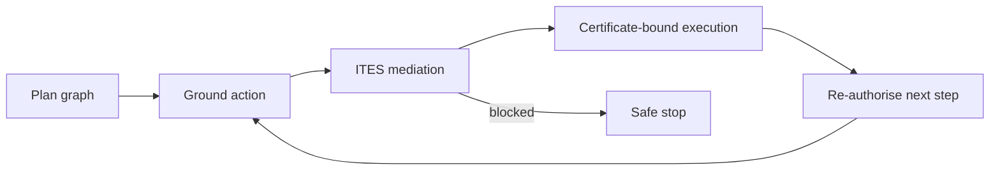

# Conflux Architecture

Conflux has one dependency direction and one mediation boundary:

- `conflux.domain` owns immutable identities, provenance, resources, actions,
  sessions, and evidence values.
- `conflux.ports` declares policy, model, provider, environment, and tracing
  protocols without choosing an implementation.
- `conflux.application` composes independent decisions and controls selected
  execution.
- `conflux.ites` owns the sole pure security transition kernel.
- `conflux.planning` grounds authenticated operations and returns every effect
  through ITES at action time.
- `conflux.evaluation` explores the operational kernel with native SLED.
- `conflux.verification` owns callback-free solver IR and optional formal
  backends; it does not replace native SLED.
- `conflux.adapters` and `conflux.experiments` translate external systems and
  aggregate evidence without redefining security decisions.

Models return immutable proposal batches. Alternatives branch independently
from one parent; ordered-plan steps propagate state, stop at the first denial
or provider failure, and are never pre-authorised. Exploration is side-effect
free. A selected effect executes only with its exact, freshly checked decision
certificate.

Open-ended plans use authenticated operation catalogues, typed bindings,
explicit loops and continuations, and visible resource bounds. Generated code
is data submitted to a mediated sandbox capability, not trusted control flow.
Runtime-to-IR differential tests define the finite subset supported by formal
backends; unsupported semantics produce `UNKNOWN`.

## Planning subsystem

Open-ended dynamic plans are untrusted data structures that ITES mediates at
every grounded effect. The planning module provides the graph, binding,
executor, and continuation types; ITES retains the sole execution boundary.

- **Plan graph** (`planning.model`): typed node taxonomy — model calls, action
  templates, branches, loops, continuations, approvals, delegations, subplans,
  and terminals.
- **Bindings** (`planning.actions`): typed argument bindings (literal, artifact,
  node-output) resolved against a binding environment before grounding.
- **Executor** (`planning.executor`): deterministic dynamic-plan executor that
  grounds each action template, submits it to ITES, and records the outcome.
  Blocked actions stop the plan or trigger a continuation patch.
- **Continuations** (`planning.continuation`): structured plan patches (add,
  replace, remove) applied to the plan graph during continuation.
- **Modeled programs** (`planning.modeled_program`): inert effect graphs used for
  static analysis and verification-IR abstraction — no execution boundary.
- **Plan state** (`planning.state`): mutable snapshot of node statuses, outputs,
  and trace events during execution.

Every grounded effect is re-mediated at action time. The planner cannot
manufacture authority; it can only propose actions that ITES then authorises
or blocks based on the current Principal Context and provenance.

## Rationale

| Decision | Why | Accepted cost |
|---|---|---|
| Immutable domain values | Security evidence must not change after a decision | New values replace old state |
| Independent policy ports | Consent or visibility must never manufacture authority | More explicit decisions and events |
| One ITES kernel | Runtime and SLED must not drift semantically; the kernel is a reference monitor providing complete mediation by a small, analysable, tamper-resistant mechanism | Every supported action crosses one narrow boundary |
| Separate exploration and execution | Alternative evaluation must not cause effects | Execution needs an exact branch certificate |
| Planning remains above ITES | Planner structure is untrusted data, not authority | Every grounded effect is re-mediated |
| Solver IR remains separate | A proof over an abstraction is not a runtime proof | Differential conformance is required |
| Benchmark adapters stay external | Benchmark conventions must not define the core | Translation assumptions remain explicit |

See the [security model](SECURITY_MODEL.md), [public reference](REFERENCE.md),
[SLED](SLED.md), and [dynamic-planning specification](../specifications/010-open-ended-dynamic-planning.md).
