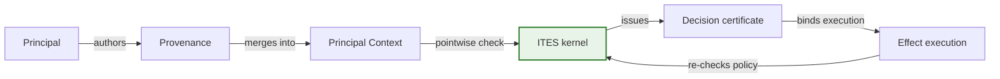

# Concept Walkthrough

This document traces a single action through the Conflux mediation pipeline to
show how the key concepts connect. It is a narrative bridge between the
[plain-language overview](../OVERVIEW.md) and the [formal
semantics](SEMANTICS.md), not a normative specification. For each concept, the
canonical owner is linked rather than restated.

The scenario used throughout is
[`examples/basic.yaml`](../../examples/basic.yaml). You can run it with:

```text
conflux demo --scenario examples/basic.yaml --output research/output/runs/demo
```

## Concept relationship

The core pipeline has one direction: a Principal influences an action through
provenance, the Principal Context is derived at action time, ITES checks every
influencing Principal against organisational policy, and only a
certificate-bound effect may execute.



| Stage | What happens | Key invariant |
|---|---|---|
| Principal | An authenticated identity (e.g. Alice) | Authority comes from policy, not identity |
| Provenance | Origin and derivation of information | Never a read ACL; never silently discarded |
| Principal Context | Conservative set of influencing Principals | Additional influence can only reduce authority |
| ITES | Sole security transition kernel; checks every Principal pointwise | Complete mediation; no bypass |
| Decision certificate | Binds action, context, branch, and policy versions | Stale or mismatched certificate blocks execution |
| Effect execution | Only with a matching certificate | Policy is re-checked at execution time |

See [SEMANTICS.md](SEMANTICS.md) for the formal algebraic properties behind
each stage, [SECURITY_MODEL.md](SECURITY_MODEL.md) for the normative rules, and
[ARCHITECTURE.md](ARCHITECTURE.md) for package dependencies.

## Scenario walkthrough

### 1. Scenario loading

The YAML file is parsed by `load_scenario` into immutable domain values:

| YAML field | Domain type | What it represents |
|---|---|---|
| `principals: [alice]` | `Principal(id="alice")` | The only authenticated identity |
| `data: [request]` | `Artifact` with `Provenance(authors={alice})` | Input data authored by Alice |
| `resources: [output.txt]` | `ResourceRef` | Protected filesystem target |
| `grants: [alice → write]` | Policy grant | Alice is authorised to write `output.txt` |
| `consent: [write-output]` | Consent record | Explicit consent for the write-output action |
| `model.proposals` | `ProposalBatch` in `ALTERNATIVES` mode | One primitive action: write to `output.txt` |

The scenario configuration cannot name Python callbacks or import code. Unknown
fields, versions, Principals, input IDs, and action kinds fail closed. See
[Runtime](RUNTIME.md) for the scenario contract.

### 2. Model proposal

The `ScriptedModel` returns the declared `ProposalBatch` containing one
proposal: a primitive `write` action targeting `output.txt` with input `request`
(the artifact authored by Alice). The model is untrusted — its output is parsed
strictly and validated against the scenario's resource allowlist.

### 3. Principal Context derivation

The ITES kernel derives the initial Principal Context from the input
provenance. The `request` artifact has `Provenance(authors={alice})`, so the
initial context is `PrincipalContext(principals={alice})`.

This is the [authority-intersection rule](SEMANTICS.md#sem-009-authority-intersection-rule-biba-low-water-mark)
(SEM-009): the context is the join of all influencing Principals. If the
artifact had been authored by both Alice and an attacker, the context would be
`{alice, attacker}`, and both would need independent authorisation.

### 4. ITES mediation

The `DecisionPipeline` composes five independent policy dimensions. Every
dimension must allow; a single denial blocks the action (SEM-005):

| Dimension | Port | Question | Result for basic.yaml |
|---|---|---|---|
| Authorisation | `AuthorisationPort` | Is Alice permitted to `write` `output.txt`? | Allow (grant exists) |
| Argument auth | `ArgumentAuthorisationPort` | Are authority-bearing selectors authorised? | Allow (no authority-bearing selectors in this action) |
| Read policy | `ReadPolicyPort` | Is Alice allowed to observe the `request` artifact? | Allow (Alice is a reader) |
| Visibility | `VisibilityPolicyPort` | Is the action visible to authorised participants? | Allow (internal visibility) |
| Consent | `ConsentPolicyPort` | Has consent been given for `write-output`? | Allow (consent record exists) |

All five allow, so the `ActionDecision.allowed` is `True`. See
[SEMANTICS.md](SEMANTICS.md#sem-005-actiondecision-is-a-conjunction-of-independent-decisions)
for the conjunction property and [SECURITY_MODEL.md](SECURITY_MODEL.md) for the
normative rules behind each dimension.

### 5. Certificate issuance

ITES issues a `DecisionCertificate` that binds:

- The action fingerprint (deterministic hash of the action's operation,
  resource, and arguments).
- The context fingerprint (deterministic hash of the Principal Context).
- The branch identity (which alternative branch this certificate belongs to).
- The policy versions (which policy snapshot was used).

This certificate is the sole authorisation for execution. A certificate from
one branch cannot authorise an effect on another (SEM-012). See
[SEMANTICS.md](SEMANTICS.md#sem-012-certificate-binding) for the binding
property.

### 6. Execution

The `MediationService` re-runs all policy dimensions immediately before the
effect. If policy has changed since the certificate was issued (e.g.
revocation), the certificate is stale and execution is blocked (SEM-013). If the
certificate matches, the `InMemoryExecutor` carries out the write and records
the outcome. The executor is idempotent by certificate ID; reuse with another
action fingerprint is rejected. See [Runtime](RUNTIME.md) for the provider
contract.

### 7. Evidence outputs

The `conflux demo` command writes three files:

| File | Contents |
|---|---|
| `trace.jsonl` | Versioned trace events with branch IDs, sequence numbers, and causal parent links |
| `result.json` | Schema-validated aggregate: proposed, authorised, blocked, executed counts; security assessments; utility outcome |
| `report.md` | Human-readable summary rendered from `result.json` |

The result JSON distinguishes proposed, authorised, blocked, executed,
provider-failed, and excluded outcomes. Security assessments like
`no_unauthorised_execution` consider only executed branches, not blocked ones
(SEM-014).

## Blocked proposal walkthrough

A blocked proposal is a **security success**, not a failure. The system detected
that an action would exceed the authority of an influencing Principal and
prevented it from executing.

Consider a modified scenario where the `request` artifact is authored by both
Alice and an attacker principal `eve` (e.g. an injected instruction in a
document). The Principal Context becomes `{alice, eve}`. If Eve does not have a
`write` grant for `output.txt`, the authorisation check fails for Eve, the
`ActionDecision` is denied, and the proposal is blocked.

The blocked branch appears in the result JSON with `status: "blocked"` and a
diagnostic reason. No effect is executed, no certificate is consumed, and the
`no_unauthorised_execution` assessment remains `true`. See
[NEGATIVE_CONTROLS.md](../evidence/NEGATIVE_CONTROLS.md) for deliberately
vulnerable mediators that fail to block such proposals and the SLED
counterexamples that detect them.

## Rationale

A single-page walkthrough that traces a concrete scenario helps new readers
build the core mental model: provenance flows into Principal Context, ITES
checks every influencer pointwise, and only a certificate-bound effect may
execute. This document links to canonical owners for each concept rather than
restating normative rules, so it cannot drift from the security contract.
