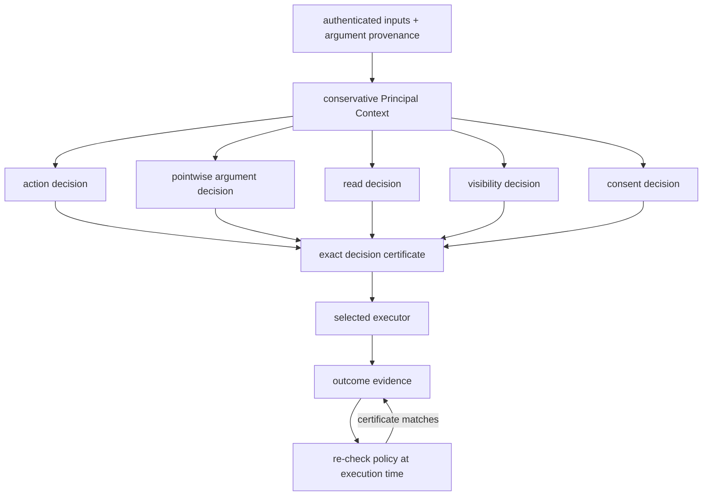

# Security Model

## Trusted computing base

| Component | Trusted responsibility |
|---|---|
| Authentication and provenance adapters | Attach complete origins; label uncertainty as unknown |
| ITES kernel | Preserve context, isolate branches, compose decisions, and issue certificates |
| Policy ports | Return faithful action, argument, read, visibility, and consent decisions |
| Optional Cedar adapter | Validate its pinned local binary and translate trusted policy, entity, action, resource, and role facts without approximation |
| Action schemas | Assign trusted roles to operation arguments and identify protected resources |
| Application service and executor | Recheck and execute only the certificate-matching action |

Models, planners, optional classifiers, and benchmark data are not trusted to
grant authority, assert decision provenance, or narrow Principal Context.

## Decision pipeline

The policy dimensions remain independently visible. Authority-bearing
arguments such as resources, recipients, destinations, and credential
references are checked for every Principal in context. Only the conjunction of
all decisions can permit an observable or effectful action, and execution
evaluates current policy state again.

## Normative rules

- Empty or unknown Principal Context denies observable, nested, delegation,
  and effectful actions.
- Every Principal in the context must receive a pointwise policy allow.
- Trusted operation schemas assign argument roles; model output cannot assign
  or change them. Missing roles and unconfigured argument policy deny.
- Provenance describes influence; read policy decides observation.
- Missing consent denies. Only internal stop and no-op can omit consent.
- Delegation remains denied at runtime. Its scoped, one-use grant model is
  implemented, but activation requires independent policy parity and all
  certificate, visibility, attribution, expiry, and revocation gates.
- Policy errors, unsupported inputs, category mismatches, stale certificates,
  provider failures, and exhausted bounds remain explicit fail-closed outcomes.
- Rejected proposals are diagnostics, not executed security violations.
- Audience disclosure is decided per event class at `none`, `existence`,
  `redacted`, or `full`; deterministic projection removes fields above that
  level.
- Attribution is derived from verified inputs, provenance, Principal Context,
  and policy evidence. Model explanations remain untrusted annotations.
- Provenance and Principal Context accumulate monotonically through nesting;
  alternative siblings remain isolated.

The current argument layer protects authority-bearing selectors. Richer
operation-specific effect semantics remain future work in the
[change catalogue](../evidence/CHANGE_CATALOG.md).

## Rationale

| Rule | Why |
|---|---|
| Require a non-empty known context | Universal checks over an empty set otherwise grant vacuous authority |
| Require every influencing Principal to be allowed | One Principal cannot lend permissions to another |
| Assign roles in trusted operation schemas | A model cannot relabel a destination or recipient as harmless content |
| Check selectors separately from whole-action authority | Consent or permission for an operation must not silently authorise its target |
| Separate provenance and read policy | Origin does not imply permission to observe |
| Project records by audience and event class | Visibility of an event does not imply visibility of every field in it |
| Derive attribution from evidence | Fluent model explanations are not proof of influence or authority |
| Keep consent restrictive only | Approval cannot substitute for organisational authority |
| Bind certificates to exact decisions | Stale or branch-mismatched approval cannot authorise another effect |
| Model delegation before activation | Authority transfer adds attenuation, ordering, expiry, revocation, and atomic-use obligations that must be evidenced before runtime use |
| Require live differential evidence before Cedar-backed activation | Successful translation and an oracle expectation do not demonstrate that an unavailable PDP agrees |
| Fail closed on errors | Infrastructure uncertainty is not evidence of permission |

### Classical foundations

The ITES mediation boundary is a reference monitor for tool-using AI agents:
it provides complete mediation of privileged effects by a small, analysable,
tamper-resistant mechanism, separating untrusted proposal generation from
trusted effect execution. The LLM is untrusted code requesting privileged
operations, not a trusted security decision-maker.

The authority-intersection rule is structurally analogous to low-water-mark
contamination from Biba's integrity models: consuming information from an
additional principal can preserve or reduce effective authority but cannot
increase it. Conflux enriches this classical pattern with authenticated
principal provenance and authority derived from the organisation's existing
authorisation relation. See [ADR 012](../decisions/012-foundational-security-lineage.md)
and the [foundational security literature
analysis](../../reports/analysis/2026-08-13-foundational-security-literature.md).

These rules prevent authority amplification; they do not prove that every
authorised action matches subjective intent. Complete mediation and correct
authentication, provenance, policy, runtime, and provider isolation remain
assumptions. See [SECURITY.md](../../SECURITY.md) for the operational boundary.
