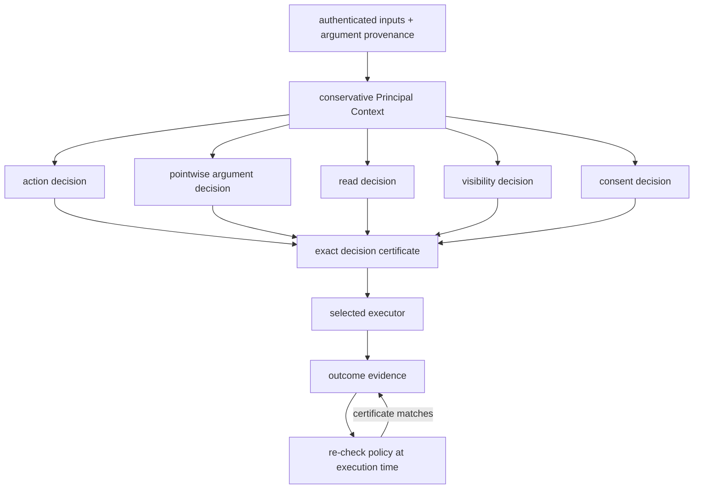

# Security Model

## Trusted computing base

| Component | Trusted responsibility |
|---|---|
| Authentication and provenance adapters | Attach complete origins; label uncertainty as unknown |
| ITES kernel | Preserve context, isolate branches, compose decisions, and issue certificates |
| Policy ports | Return faithful action, argument, read, visibility, and consent decisions |
| Optional Cedar adapter | Validate its pinned local binary and translate trusted policy, entity, action, resource, and role facts without approximation |
| Action schemas | Assign trusted roles to operation arguments and identify protected resources |
| Application service and executor | Recheck and execute only the certificate-matching action |

Models, planners, optional classifiers, and benchmark data are not trusted to
grant authority, assert decision provenance, or narrow Principal Context.
A model may nevertheless be relied upon probabilistically for semantic judgement
within already available authority; this does not grant it the power to
establish, expand, or narrow authority. See
[ADR-025](../decisions/025-authority-confinement-semantic-judgement-delegation.md).

## Security assurance layers

Conflux distinguishes three security questions:

1. **Authority confinement:** can an execution exercise machine-enforceable
   authority outside the envelope available to every influencing principal?
   ITES addresses this under its stated assumptions.
2. **Semantic judgement:** given authority to choose among several permitted
   effects, does the decision-maker choose an appropriate effect for the real
   task and context? This is not guaranteed by ITES. Humans and models both
   perform this role with empirical, not worst-case, assurance.
3. **Policy adequacy:** does the machine-readable authority policy represent
   all of the organisation's intended restrictions? Usually not perfectly;
   human/model semantic judgement resolves conditions not encoded in the
   explicit ACS.

Model-level prompt-injection defences are genuine security controls that
reduce the probability of inappropriate decisions. Their assurance is
empirical/probabilistic and can degrade under distribution shift or adaptive
attacks. Conflux provides a complementary system-level authority-confinement
layer whose core property holds under arbitrary model proposals. The two
layers defend different failure modes and should normally be combined.

## Explicit and effective authority policy

Conflux distinguishes the organisation's persistent machine-readable authority
relation from the execution-effective relation used by ITES:

- **`ACS_explicit`**: the persistent machine-readable authorisation state
  supplied by the organisation/PDP (e.g. RBAC, ABAC, ReBAC, IAM, or
  Cedar-style decisions). It is an external trust assumption and input to the
  core theorem.
- **`D_e`**: the set of valid, explicit, scoped delegation grants applicable
  to execution `e`. A grant must be independently authorised; permission to
  perform an action does not automatically imply permission to delegate it.
- **`ACS_effective(e)`**: the authority relation ITES evaluates for `e` after
  combining `ACS_explicit` with `D_e`:

  ```text
  ACS_effective(e, p, a) = ACS_explicit(p, a) OR DelegatedAllow(D_e, p, a)
  ```

  where `DelegatedAllow` includes beneficiary, issuer, resource, argument,
  lifetime, use-count, revocation, and other configured scope checks.

Delegation does not overwrite the explicit ACS globally. It creates a scoped
effective authority relation for the applicable execution. Runtime delegation
remains disabled; these semantics are specification-level.

See [ADR-025](../decisions/025-authority-confinement-semantic-judgement-delegation.md).

## Authority envelope

The **authority envelope** of execution `e` is the set of machine-enforceable
effects that pass the Principal-Context authority checks under
`ACS_effective(e)` and the trusted operation/argument authority schema:

```text
AuthorityEnvelope(e) = {
    a | PC(e) known/non-empty
        and forall p in PC(e): ACS_effective(e, p, a)
        and action/argument authority checks pass
}
```

Conflux guarantees confinement to this represented envelope under its
assumptions. It does not guarantee that a human or model chooses the
semantically best member of the envelope.

## Decision pipeline



The policy dimensions remain independently visible. Authority-bearing
arguments such as resources, recipients, destinations, and credential
references are checked for every Principal in context. Only the conjunction of
all decisions can permit an observable or effectful action, and execution
evaluates current policy state again.

## Normative rules

- Empty or unknown Principal Context denies observable, nested, delegation,
  and effectful actions.
- Every Principal in the context must receive a pointwise policy allow.
- Trusted operation schemas assign argument roles; model output cannot assign
  or change them. Missing roles and unconfigured argument policy deny.
- Provenance describes influence; read policy decides observation.
- Missing consent denies. Only internal stop and no-op can omit consent.
- Delegation remains denied at runtime. Its scoped, one-use grant model is
  implemented, but activation requires independent policy parity and all
  certificate, visibility, attribution, expiry, and revocation gates.
- Policy errors, unsupported inputs, category mismatches, stale certificates,
  provider failures, and exhausted bounds remain explicit fail-closed outcomes.
- Rejected proposals are diagnostics, not executed security violations.
- Audience disclosure is decided per event class at `none`, `existence`,
  `redacted`, or `full`; deterministic projection removes fields above that
  level.
- Attribution is derived from verified inputs, provenance, Principal Context,
  and policy evidence. Model explanations remain untrusted annotations.
- Provenance and Principal Context accumulate monotonically through nesting;
  alternative siblings remain isolated.
- For ordinary derived objects, `PC(output) ⊇ PC(execution inputs)`.
  Scheduled executions and persistent artefacts inherit the scheduling or
  deriving context's Principal Context. New assistant calls or sessions cannot
  reset Principal Context. Current Conflux execution does not reduce Principal
  Context. Any future exception requires a separately accepted semantics and
  proof obligation
  ([ADR-025](../decisions/025-authority-confinement-semantic-judgement-delegation.md)).
- An externally fetched object retains the authenticated provenance of its
  actual source(s). It does not inherit the requesting user's organisational
  authority merely because the request was made on the user's behalf.

The current argument layer protects authority-bearing selectors. Richer
operation-specific effect semantics remain future work in the
[change catalogue](../evidence/CHANGE_CATALOG.md).

## External provenance and tool outputs

The source of an output and the principal on whose behalf a tool executes are
different concepts. Every object should distinguish at least:

- **Producer/author principal(s):** who controlled the object's contents.
- **Execution/agency principal(s):** on whose behalf the operation was
  requested.
- **Transport/tool identity:** which system retrieved or produced it.
- **Provenance:** the principals whose information can conservatively influence
  downstream computation.

The second must not silently become the first. For a web page the default
provenance should normally be the authenticated external source or an explicit
`Internet` principal, not the user who requested the fetch. The same applies to
inbound email, API responses, tool-generated objects, database results returned
through a user's session, and LLM-generated persistent objects.

## Authentication and utility

Authentication is part of the trusted computing base. It establishes that
provenance labels correspond to the actual source of information. It does not
grant that source organisational authority, does not tell ITES whether the
content is malicious, and does not remove the source from Principal Context.

Two distinct problems must not be conflated:

1. **Provenance uncertainty:** before authentication and fine-grained
   attribution, conservative provenance may unnecessarily enlarge Principal
   Context and reduce utility. Authenticated, appropriately chunked
   object-level provenance reduces this unnecessary loss.
2. **Genuine low-authority influence:** after authenticated provenance
   establishes that an external principal authored relevant content, that
   principal's low permissions legitimately constrain the execution. Better
   authentication does not remove this restriction.

> Authentication makes the security decision accurate; it does not make the
> decision permissive.

## Authority versus harm

ITES prevents authority amplification relative to the granularity of the ACS.
It does not by itself guarantee that authorised actions are safe, intended, or
optimally parameterised. If both influencing principals can perform
`send_email`, an attacker-controlled input may still influence which recipient,
amount, or attachment is selected. Coarse action permission does not imply safe
parameter values.

Three separate questions must be distinguished:

1. **Authority safety:** can influence cause execution outside the influencers'
   authority? ITES addresses this.
2. **Intent/safety within authority:** can the model choose a harmful action
   that is already authorised? Core ITES does not address this.
3. **Policy adequacy:** did the ACS itself grant excessive authority? This is
   outside the core ITES guarantee.

Authority-bearing argument checks reduce but do not eliminate the gap between
authority confinement and harm prevention. Finer operation-specific effect
semantics remain future work.

## Semantic judgement within authority

Given authority to choose among several permitted effects, whether the
decision-maker chooses an appropriate effect for the real task and context is
a semantic judgement. Examples include whether a customer request is
legitimate, whether an email is social engineering, or which of several
already-delegated actions is appropriate.

These predicates can depend on natural language, incomplete evidence,
context, and organisational norms. They may not be fully captured by the
explicit machine-readable ACS. Human employees routinely resolve such
conditions; AI agents may serve the same role. Neither role carries a formal
correctness guarantee.

ITES bounds the authority available to a semantic decision but does not
prove that the decision is appropriate. Model-level defences, training, and
human oversight can reduce the probability of inappropriate choices, but
this is empirical rather than worst-case assurance.

## Humans, models, and model-level defences

Model-level prompt-injection defences — instruction hierarchy, fine-tuning,
classifiers, and similar techniques — are genuine security controls that
reduce the probability of malicious or inappropriate decisions. Their
evidence is empirical/probabilistic and can degrade under distribution shift
or adaptive attacks. Conflux provides a complementary system-level
authority-confinement layer whose core property is defined under arbitrary
model proposals.

A privileged employee may read arbitrary external email and then exercise
privileged actions. The machine ACS often grants the employee broad action
authority and relies on the employee to determine whether a particular
email/request legitimately warrants using it. Phishing training improves
security but does not prove that every decision is correct. Replacing the
human with an AI agent does not make the semantic decision problem
disappear.

A model can be untrusted for authority establishment while still being
relied upon, probabilistically, for semantic judgement within already
granted authority.

## Rationale

| Rule | Why |
|---|---|
| Require a non-empty known context | Universal checks over an empty set otherwise grant vacuous authority |
| Require every influencing Principal to be allowed | One Principal cannot lend permissions to another |
| Assign roles in trusted operation schemas | A model cannot relabel a destination or recipient as harmless content |
| Check selectors separately from whole-action authority | Consent or permission for an operation must not silently authorise its target |
| Separate provenance and read policy | Origin does not imply permission to observe |
| Project records by audience and event class | Visibility of an event does not imply visibility of every field in it |
| Derive attribution from evidence | Fluent model explanations are not proof of influence or authority |
| Keep consent restrictive only | Approval cannot substitute for organisational authority |
| Bind certificates to exact decisions | Stale or branch-mismatched approval cannot authorise another effect |
| Model delegation before activation | Authority transfer adds attenuation, ordering, expiry, revocation, and atomic-use obligations that must be evidenced before runtime use |
| Require live differential evidence before Cedar-backed activation | Successful translation and an oracle expectation do not demonstrate that an unavailable PDP agrees |
| Fail closed on errors | Infrastructure uncertainty is not evidence of permission |
| Distinguish authority confinement from semantic judgement | ITES bounds authority; it does not prove appropriateness of choices within authority | [ADR-025](../decisions/025-authority-confinement-semantic-judgement-delegation.md) |

### Classical foundations

The ITES mediation boundary is a reference monitor for tool-using AI agents:
it provides complete mediation of privileged effects by a small, analysable,
tamper-resistant mechanism, separating untrusted proposal generation from
trusted effect execution. The LLM is untrusted code requesting privileged
operations, not a trusted authority-establishment decision-maker. A deployment
may nevertheless rely on it probabilistically for semantic judgement within
already available authority.

The authority-intersection rule is structurally analogous to low-water-mark
contamination from Biba's integrity models: consuming information from an
additional principal can preserve or reduce effective authority but cannot
increase it. Conflux enriches this classical pattern with authenticated
principal provenance and authority derived from the organisation's existing
authorisation relation.

The classical lineage extends beyond Biba and LOMAC. HiStar demonstrates that
strict information-flow control can be enforced by a small trusted kernel with
explicit labels, directly informing the ITES reference-monitor boundary. Flume
applies decentralized IFC at the process/OS abstraction with a reference
monitor interposition architecture, paralleling Conflux's separation of
untrusted model proposals from trusted effect execution. Asbestos provides
kernel-enforced labels and event-process isolation for systems acting on behalf
of multiple principals, a setting structurally similar to multi-principal agent
execution. Clark-Wilson provides a model of integrity through certified
transformations and separation of duties. Conflux does not currently
implement an endorsement or trusted-transformation mechanism; any future
mechanism that reduces conservative provenance requires a separately
accepted design and proof obligation
([ADR-025](../decisions/025-authority-confinement-semantic-judgement-delegation.md)).

See [ADR 012](../decisions/012-foundational-security-lineage.md),
[ADR 024](../decisions/024-external-provenance-and-authority-bounds.md),
and the [foundational security literature
analysis](../../research/reports/analysis/2026-08-13-foundational-security-literature.md).

These rules prevent authority amplification; they do not prove that every
authorised action matches subjective intent. Complete mediation and correct
authentication, provenance, policy, runtime, and provider isolation remain
assumptions.

## Common misconceptions

The following table restates corrections for misconceptions that arise
frequently. Each correction links to the normative section or formal property
that establishes it.

| Misconception | Correction | Reference |
|---|---|---|
| ITES prevents all harm | ITES prevents authority amplification, not harm within already-authorised actions | [Authority versus harm](#authority-versus-harm) |
| Provenance is a read ACL | Provenance describes influence origin; read policy is a separate, independent decision | [SEM-004](SEMANTICS.md#sem-004-provenance-is-not-a-read-acl) |
| Consent can grant authority | Consent is restricting only; it can deny but never permit | [SEM-006](SEMANTICS.md#sem-006-consent-never-manufactures-authority) |
| A blocked proposal is a failure | A blocked proposal is a security success — the system prevented an unauthorised action | [SEM-014](SEMANTICS.md#sem-014-rejected-proposals-are-diagnostics-not-violations) |
| SLED proves unbounded safety | SLED is bounded; `SAFE` means the finite state space was exhausted, not a proof of unbounded behaviour | [ADR-010](../decisions/010-sled-verdicts.md) |
| Authentication removes principals from context | Authentication makes the decision accurate; it does not remove the source from Principal Context | [Authentication and utility](#authentication-and-utility) |
| Delegation is active | Delegation is modelled but runtime-disabled pending activation evidence | [Normative rules](#normative-rules) |
| No formal guarantee means no security value | Model-level/human mitigations can reduce risk empirically, while ITES provides a different assurance class | [Humans, models, and model-level defences](#humans-models-and-model-level-defences) |
| If ITES blocks a task, the ACS must be wrong | Some tasks depend on semantic judgement not represented in the machine-readable policy | [Semantic judgement within authority](#semantic-judgement-within-authority) |

## Operational boundary

Conflux is pre-1.0 research software, not a production security product.
Report vulnerabilities privately to the repository owner rather than placing
credentials, exploit payloads, or confidential traces in a public issue.

External model secrets are read from environment variables only and must not
be committed to manifests, logs, fixtures, or retained responses. Keep Docker,
model, solver, benchmark, and cluster workflows optional and credential-free
by default.

Supported security fixes target the current default branch. There is no stable
0.1 API compatibility promise yet.
