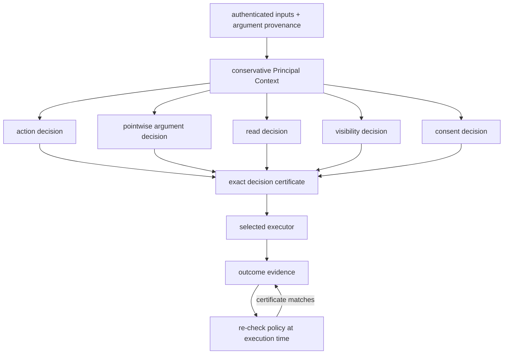

# Security Model

## Trusted computing base

| Component | Trusted responsibility |
|---|---|
| Authentication and provenance adapters | Attach complete origins; label uncertainty as unknown |
| ITES kernel | Preserve context, isolate branches, compose decisions, and issue certificates |
| Policy ports | Return faithful action, argument, read, visibility, and consent decisions |
| Optional Cedar adapter | Validate its pinned local binary and translate trusted policy, entity, action, resource, and role facts without approximation |
| Action schemas | Assign trusted roles to operation arguments and identify protected resources |
| Application service and executor | Recheck and execute only the certificate-matching action |

Models, planners, optional classifiers, and benchmark data are not trusted to
grant authority, assert decision provenance, or narrow Principal Context.

## Decision pipeline

The policy dimensions remain independently visible. Authority-bearing
arguments such as resources, recipients, destinations, and credential
references are checked for every Principal in context. Only the conjunction of
all decisions can permit an observable or effectful action, and execution
evaluates current policy state again.

## Normative rules

- Empty or unknown Principal Context denies observable, nested, delegation,
  and effectful actions.
- Every Principal in the context must receive a pointwise policy allow.
- Trusted operation schemas assign argument roles; model output cannot assign
  or change them. Missing roles and unconfigured argument policy deny.
- Provenance describes influence; read policy decides observation.
- Missing consent denies. Only internal stop and no-op can omit consent.
- Delegation remains denied at runtime. Its scoped, one-use grant model is
  implemented, but activation requires independent policy parity and all
  certificate, visibility, attribution, expiry, and revocation gates.
- Policy errors, unsupported inputs, category mismatches, stale certificates,
  provider failures, and exhausted bounds remain explicit fail-closed outcomes.
- Rejected proposals are diagnostics, not executed security violations.
- Audience disclosure is decided per event class at `none`, `existence`,
  `redacted`, or `full`; deterministic projection removes fields above that
  level.
- Attribution is derived from verified inputs, provenance, Principal Context,
  and policy evidence. Model explanations remain untrusted annotations.
- Provenance and Principal Context accumulate monotonically through nesting;
  alternative siblings remain isolated.
- For ordinary derived objects, `PC(output) ⊇ PC(execution inputs)`.
  Scheduled executions and persistent artefacts inherit the scheduling or
  deriving context's Principal Context. New assistant calls or sessions cannot
  reset Principal Context. Only an explicitly trusted, separately modelled
  transformation may reduce influence.
- An externally fetched object retains the authenticated provenance of its
  actual source(s). It does not inherit the requesting user's organisational
  authority merely because the request was made on the user's behalf.

The current argument layer protects authority-bearing selectors. Richer
operation-specific effect semantics remain future work in the
[change catalogue](../evidence/CHANGE_CATALOG.md).

## External provenance and tool outputs

The source of an output and the principal on whose behalf a tool executes are
different concepts. Every object should distinguish at least:

- **Producer/author principal(s):** who controlled the object's contents.
- **Execution/agency principal(s):** on whose behalf the operation was
  requested.
- **Transport/tool identity:** which system retrieved or produced it.
- **Provenance:** the principals whose information can conservatively influence
  downstream computation.

The second must not silently become the first. For a web page the default
provenance should normally be the authenticated external source or an explicit
`Internet` principal, not the user who requested the fetch. The same applies to
inbound email, API responses, tool-generated objects, database results returned
through a user's session, and LLM-generated persistent objects.

## Authentication and utility

Authentication is part of the trusted computing base. It establishes that
provenance labels correspond to the actual source of information. It does not
grant that source organisational authority, does not tell ITES whether the
content is malicious, and does not remove the source from Principal Context.

Two distinct problems must not be conflated:

1. **Provenance uncertainty:** before authentication and fine-grained
   attribution, conservative provenance may unnecessarily enlarge Principal
   Context and reduce utility. Authenticated, appropriately chunked
   object-level provenance reduces this unnecessary loss.
2. **Genuine low-authority influence:** after authenticated provenance
   establishes that an external principal authored relevant content, that
   principal's low permissions legitimately constrain the execution. Better
   authentication does not remove this restriction.

> Authentication makes the security decision accurate; it does not make the
> decision permissive.

## Authority versus harm

ITES prevents authority amplification relative to the granularity of the ACS.
It does not by itself guarantee that authorised actions are safe, intended, or
optimally parameterised. If both influencing principals can perform
`send_email`, an attacker-controlled input may still influence which recipient,
amount, or attachment is selected. Coarse action permission does not imply safe
parameter values.

Three separate questions must be distinguished:

1. **Authority safety:** can influence cause execution outside the influencers'
   authority? ITES addresses this.
2. **Intent/safety within authority:** can the model choose a harmful action
   that is already authorised? Core ITES does not address this.
3. **Policy adequacy:** did the ACS itself grant excessive authority? This is
   outside the core ITES guarantee.

Authority-bearing argument checks reduce but do not eliminate the gap between
authority confinement and harm prevention. Finer operation-specific effect
semantics remain future work.

## Rationale

| Rule | Why |
|---|---|
| Require a non-empty known context | Universal checks over an empty set otherwise grant vacuous authority |
| Require every influencing Principal to be allowed | One Principal cannot lend permissions to another |
| Assign roles in trusted operation schemas | A model cannot relabel a destination or recipient as harmless content |
| Check selectors separately from whole-action authority | Consent or permission for an operation must not silently authorise its target |
| Separate provenance and read policy | Origin does not imply permission to observe |
| Project records by audience and event class | Visibility of an event does not imply visibility of every field in it |
| Derive attribution from evidence | Fluent model explanations are not proof of influence or authority |
| Keep consent restrictive only | Approval cannot substitute for organisational authority |
| Bind certificates to exact decisions | Stale or branch-mismatched approval cannot authorise another effect |
| Model delegation before activation | Authority transfer adds attenuation, ordering, expiry, revocation, and atomic-use obligations that must be evidenced before runtime use |
| Require live differential evidence before Cedar-backed activation | Successful translation and an oracle expectation do not demonstrate that an unavailable PDP agrees |
| Fail closed on errors | Infrastructure uncertainty is not evidence of permission |

### Classical foundations

The ITES mediation boundary is a reference monitor for tool-using AI agents:
it provides complete mediation of privileged effects by a small, analysable,
tamper-resistant mechanism, separating untrusted proposal generation from
trusted effect execution. The LLM is untrusted code requesting privileged
operations, not a trusted security decision-maker.

The authority-intersection rule is structurally analogous to low-water-mark
contamination from Biba's integrity models: consuming information from an
additional principal can preserve or reduce effective authority but cannot
increase it. Conflux enriches this classical pattern with authenticated
principal provenance and authority derived from the organisation's existing
authorisation relation.

The classical lineage extends beyond Biba and LOMAC. HiStar demonstrates that
strict information-flow control can be enforced by a small trusted kernel with
explicit labels, directly informing the ITES reference-monitor boundary. Flume
applies decentralized IFC at the process/OS abstraction with a reference
monitor interposition architecture, paralleling Conflux's separation of
untrusted model proposals from trusted effect execution. Asbestos provides
kernel-enforced labels and event-process isolation for systems acting on behalf
of multiple principals, a setting structurally similar to multi-principal agent
execution. Clark-Wilson provides a model of integrity through certified
transformations and separation of duties, which frames the future
trusted-transformation question: under what explicitly modelled operation may
conservative influence be reduced without letting arbitrary untrusted input
choose the transformation?

See [ADR 012](../decisions/012-foundational-security-lineage.md),
[ADR 024](../decisions/024-external-provenance-and-authority-bounds.md),
and the [foundational security literature
analysis](../../research/reports/analysis/2026-08-13-foundational-security-literature.md).

These rules prevent authority amplification; they do not prove that every
authorised action matches subjective intent. Complete mediation and correct
authentication, provenance, policy, runtime, and provider isolation remain
assumptions.

## Common misconceptions

The following table restates corrections for misconceptions that arise
frequently. Each correction links to the normative section or formal property
that establishes it.

| Misconception | Correction | Reference |
|---|---|---|
| ITES prevents all harm | ITES prevents authority amplification, not harm within already-authorised actions | [Authority versus harm](#authority-versus-harm) |
| Provenance is a read ACL | Provenance describes influence origin; read policy is a separate, independent decision | [SEM-004](SEMANTICS.md#sem-004-provenance-is-not-a-read-acl) |
| Consent can grant authority | Consent is restricting only; it can deny but never permit | [SEM-006](SEMANTICS.md#sem-006-consent-never-manufactures-authority) |
| A blocked proposal is a failure | A blocked proposal is a security success — the system prevented an unauthorised action | [SEM-014](SEMANTICS.md#sem-014-rejected-proposals-are-diagnostics-not-violations) |
| SLED proves unbounded safety | SLED is bounded; `SAFE` means the finite state space was exhausted, not a proof of unbounded behaviour | [ADR-010](../decisions/010-sled-verdicts.md) |
| Authentication removes principals from context | Authentication makes the decision accurate; it does not remove the source from Principal Context | [Authentication and utility](#authentication-and-utility) |
| Delegation is active | Delegation is modelled but runtime-disabled pending activation evidence | [Normative rules](#normative-rules) |

## Operational boundary

Conflux is pre-1.0 research software, not a production security product.
Report vulnerabilities privately to the repository owner rather than placing
credentials, exploit payloads, or confidential traces in a public issue.

External model secrets are read from environment variables only and must not
be committed to manifests, logs, fixtures, or retained responses. Keep Docker,
model, solver, benchmark, and cluster workflows optional and credential-free
by default.

Supported security fixes target the current default branch. There is no stable
0.1 API compatibility promise yet.
