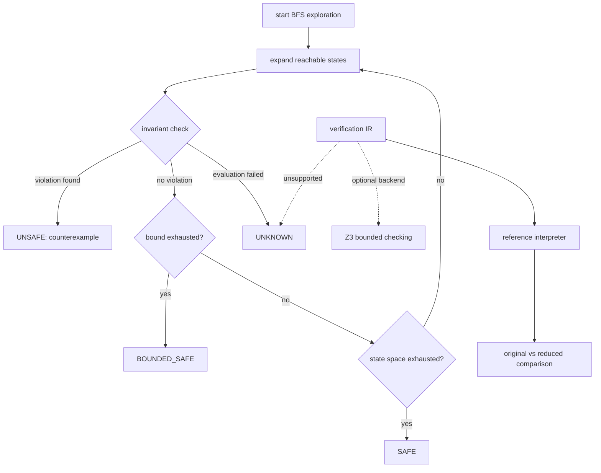

# SLED Native Verification

SLED explores a typed transition system breadth-first, memoises canonical
future-relevant state, retains predecessor edges, and reports the shortest
discovered counterexample.

| Verdict | Meaning |
|---|---|
| `SAFE` | The finite reachable state space was exhausted without violation |
| `BOUNDED_SAFE` | No violation was found, but a configured bound truncated work |
| `UNSAFE` | A safety property failed with a counterexample |
| `UNKNOWN` | Modelling, property, or adapter evaluation failed |



Depth, state, transition, and model-call bounds are explicit. Results retain
unique states, transitions, duplicates, truncation, and counterexample length.
ITES properties cover unauthorised execution, forbidden observation,
provenance preservation, Principal Context monotonicity, branch isolation, and
bounded resource use.

Planning SLED models any schema-valid continuation and worst-case effects
within a generated-code capability envelope. Plan, continuation, effect, and
model-call bounds remain part of the verdict. A shared semantic corpus checks
policy composition against the kernel. Executable defective variants cover
empty-context allowance, permission union, provenance-as-ACL, stale context,
sibling leakage, and rejected-proposal misclassification.

The combinatorial adapter supports auto-enumeration of nested execution
candidates from environment data via `CombinatorialVerificationSystem.from_environment`,
matching the original prototype's powerset-of-data exploration. Depth-dependent
option sets restrict proposals at the final model-call depth via
`final_primitive_only` and `final_max_batch_size`, matching the prototype's
distinction between intermediate and final LLM call option sets.

`EnvironmentSnapshot.all_principals` exposes the union of all authors and
readers across environment data, matching the prototype's `total_users`
computation.

Task-level diagnostics extend the 8-category branch classification with 6
additional categories (`TaskDiagnosticCategory`) that classify nested execution
branches by whether task data is present, readable, and genuine — matching the
prototype's `gen_task` recursive taxonomy.

`conflux.verification` is a separate callback-free IR with a reference
interpreter, runtime differential tests, optional Z3 bounded checking, and a
nuXmv Boolean-subset adapter. Its property-scoped cone-of-influence reducer
closes over guards and assignment dependencies, projects synchronous updates,
and preserves rule IDs for witness replay. The comparison API checks original
and reduced reference verdicts and rejects an unliftable reduced witness.
Missing or unsupported backends return `UNKNOWN`. Partial-order reduction,
Principal symmetry, hyperproperties, arbitrary-program proofs, and unbounded
deployment claims remain future work.

## Related research

- [Maximal security and synthesis](../../research/reports/analysis/MAXIMAL_SECURITY_AND_SYNTHESIS.md): formalises the claim that ITES is the maximally permissive PE-safe controller and proposes a controller-synthesis experiment.
- [Comparative defence verification](../../research/reports/analysis/COMPARATIVE_DEFENCE_VERIFICATION.md): research design for verifying contemporary agent defences against the Conflux PE property. A counterexample demonstrates non-implication between security objectives, not a defect in the compared system.
- [Foundational security literature](../../research/reports/analysis/2026-08-13-foundational-security-literature.md): classical integrity and IFC lineage underlying ITES and the property hierarchy below.

## SLED-V property hierarchy

The following hierarchy structures the properties that SLED-V can or should
verify, informed by the classical IFC and integrity literature. Properties
currently supported by native SLED are marked; the remainder are reference
targets for future verification work.

### Authority safety (supported)

```text
AG(Execute(a) -> forall p in PrincipalContext: Authorised(p, a))
```

No executed action violates Principal-Context authority. This confines
authority amplification; it does not prevent harm within already-authorised
actions (e.g., an attacker influencing which recipient an authorised
`send_email` targets).

### Provenance monotonicity (supported)

Absent an explicit trusted transformation:

```text
PC(parent) subseteq PC(child)
```

Influence is never silently discarded.

### Delegation safety (IR-encoded, bounded evidence)

Any authority increase is explained by an independently authorised delegation
transition. The delegation `consume()` logic is encoded as `VerificationIR`
transition rules with mutation variants, making it available to all backends
(Z3, nuXmv, reference interpreter) and serialisable for reproducibility.

Properties verified: attenuation, single-use, expiry, revocation, beneficiary
binding, non-redelegation, pre-influence ordering, context preservation,
cascade containment, authority narrowing, and TOCTOU drift detection.

See `src/conflux/verification/delegation_ir.py`. The native SLED delegation
model (`conflux.evaluation.delegation_verification`) coexists — it tests the
actual implementation, while the IR encoding tests the abstract property.

### Read safety (supported)

No execution receives a resource contrary to read policy.

### Observational confidentiality (bounded evidence)

Executions differing only in secret information produce equivalent observations
for unauthorised principals, modulo declared declassification. This is a
relational property requiring comparison of execution pairs, unlike the
safety properties above which are checked on individual traces. Authorised
reads do not establish noninterference.

Verification uses IR self-composition (Barthe, D'Argenio, and Rezk 2004):
the verification IR is doubled into a product system with primed variable
copies, confidentiality invariants assert `observable == observable__prime`,
and the existing Z3 BMC backend and COI reducer verify the product without
modification. The encoding is bounded: it produces `bounded_evidence`, not a
proof of unbounded noninterference. See
`src/conflux/verification/self_composition.py`.

### Robust disclosure (future work)

An unauthorised influencing principal cannot control disclosure beyond the
permitted release policy. This connects to robust-declassification literature
and is relevant to prompt-injection resistance for visibility/declassification
decisions.

### Liveness / utility (bounded evidence)

Under an explicit competence/controller assumption, an authorised task reaches
its goal or a defined safe abort. Encoded as a bounded liveness invariant
`AG(step >= bound -> terminated)` in the plan IR, verified by Z3 BMC. See
`src/conflux/verification/plan_ir.py`.

### Monotonic confinement (IR-encoded, bounded evidence)

Authority cannot widen across plan continuations: `A(P') ⊆ A(P)`. Encoded
as an IR invariant over the `authority_set` variable. See
`src/conflux/verification/plan_ir.py`.

### Revocation propagation (IR-encoded, bounded evidence)

After revocation is received, no downstream effects execute. Encoded as
`AG(revocation_received -> not unauthorised_executed)`. See
`src/conflux/verification/plan_ir.py`.

### Self-composition optimization (bounded evidence)

Principal symmetry reduction and read-policy projection reduce the
product IR state space. Symmetry-breaking constraints eliminate equivalent
state permutations. See `src/conflux/verification/symmetry_reduction.py`.

## Rationale

Breadth-first search produces small diagnostic witnesses. Canonical state and
deduplication control repeated exploration without erasing distinctions that
can affect later security decisions.

`SAFE` is reserved for an exhausted finite state space. Bounds weaken the
verdict to `BOUNDED_SAFE`, while modelling failures yield `UNKNOWN`; neither is
silently promoted to proof. Native SLED stays close to the operational kernel,
while solver IR stays separate so automation cannot hide abstraction costs.
COI reduction is property-scoped because variables irrelevant to one safety
claim may be essential to another. It is accepted only with explicit
assumptions and original-versus-reduced comparison; a smaller model alone is
not evidence of preservation.
